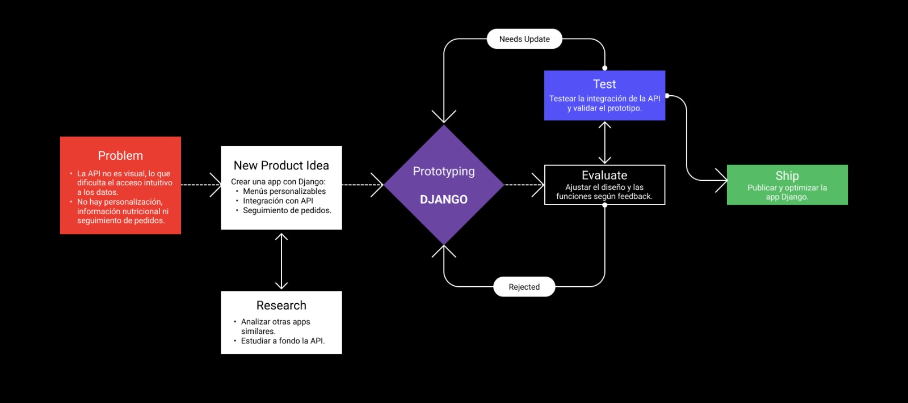
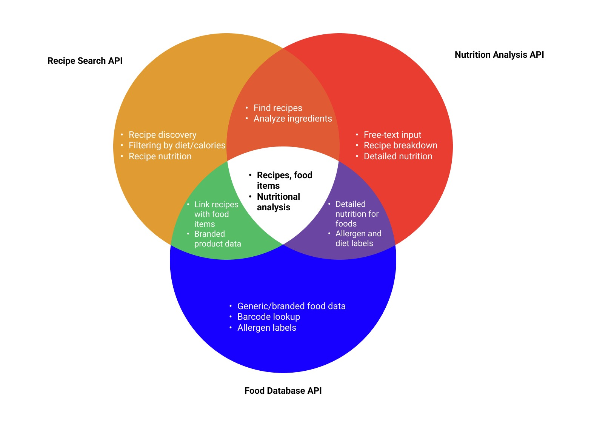

# **Little Italy - Pizzería Online con Django.**
Este proyecto constituye una aplicación web avanzada desarrollada para gestionar de manera integral las operaciones de una pizzería. Basado en el framework **Django**, el sistema incorpora diversas funcionalidades modernas, como la integración de **APIs externas**, la gestión de usuarios, un carrito de compras robusto y una experiencia de pago segura mediante **Stripe**. El diseño visual de la aplicación fue conceptualizado en **Figma** y posteriormente implementado en HTML utilizando **Builder.io**, garantizando una interfaz responsiva y eficiente. Además, el despliegue de la aplicación se realizó utilizando **Vercel**, asegurando un entorno de hosting escalable y de alto rendimiento para ofrecer una experiencia fluida a los usuarios. Adicionalmente, se han configurado pipelines automatizados mediante **GitHub Actions**, encargados de tareas como la actualización periódica de los datos provenientes de la API de Edamam.

Para asegurar una gestión segura y escalable de las configuraciones sensibles, las variables de entorno críticas, como credenciales de la base de datos, claves API y configuraciones específicas del entorno, se almacenan en un archivo oculto `.env`. Este enfoque no solo protege información confidencial, sino que también facilita la portabilidad del proyecto entre distintos entornos de desarrollo, prueba y producción, cumpliendo con las mejores prácticas de desarrollo web.

Este proyecto fue desarrollado por **Claudia López** - [@clauloro](https://github.com/clauloro) y **María González** - [@mgonzalz](https://github.com/mgonzalz), quienes trabajaron en colaboración para implementar esta aplicación web. El código fuente completo se encuentra disponible en el repositorio de GitHub: [https://github.com/mgonzalz/doo_little-italy](https://github.com/mgonzalz/doo_little-italy).

## Tecnologías Empleadas.
- **Django.** Framework backend para la estructuración y funcionalidad del proyecto.
- **Builder.io.** Herramienta para la conversión de prototipos diseñados en Figma a plantillas HTML optimizadas.
- **GitHub Actions.** Plataforma de integración continua utilizada para automatizar tareas críticas, como la actualización periódica de datos provenientes de la API de Edamam, y otros procesos relacionados con el mantenimiento del proyecto.
- **MailTrap.** Servicio para el testing seguro de correos electrónicos en entornos de desarrollo sin necesidad de utilizar cuentas reales.
- **PostgreSQL.** Base de datos relacional utilizada para el almacenamiento de datos, alojada en Railway.
- **Stripe.** Solución de pasarela de pago integrada para la verificación y procesamiento seguro de transacciones.
- **Vercel.** Plataforma de despliegue utilizada para alojar la aplicación, proporcionando un entorno escalable y de alto rendimiento.
- **APIs de Edamam**:
    - **[Nutrition API.](https://developer.edamam.com/edamam-nutrition-api)** Proporciona información detallada sobre los valores nutricionales de los ingredientes.
    - **[Recipes API.](https://developer.edamam.com/edamam-recipe-api)** Ofrece recetas predefinidas con información nutricional, ingredientes y detalles específicos.

## Aplicaciones del Proyecto.
1. **Core.** Repositorio central para almacenar páginas y elementos que no requieren modificaciones dinámicas, sirviendo como la base de la estructura del sistema.
2. **Authentication.** Manejo avanzado de usuarios, incluyendo: Registro, inicio y cierre de sesión; Modificación de datos personales; Seguridad basada en sesiones autenticadas.
3. **Cart.**
    - **Implementación de un carrito** de compras dinámico, que incluye:
        - Añadir recetas prediseñadas o pizzas personalizadas.
        - Modificación y eliminación de elementos.
        - Seguimiento del estado del pedido (Pendiente, En Proceso, Entregado, Cancelado).

    - **Gestión Administrativa.** Superusuarios pueden gestionar y actualizar los pedidos desde el panel de administración de Django.
    - **Integración con Stripe.** Procesamiento de pagos seguro mediante el modo de prueba de Stripe. Registro automático de pedidos exitosos en el historial del usuario.
    - **Historial de Pedidos.** Listado cronológico de pedidos realizados, con detalles como estado, fecha y total.

4. **Contact.** Formulario funcional para que los usuarios puedan enviar consultas o sugerencias. Integración con **Mailtrap** para pruebas seguras de envío de correos electrónicos.
5. **Nutrition.** Integración con la API de Nutrición de Edamam para:
    - Seleccionar ingredientes y obtener datos nutricionales completos (calorías, grasas, proteínas, carbohidratos, etc.).
    - Permitir a los usuarios crear pizzas personalizadas ajustando ingredientes y calcular automáticamente el precio y las calorías.
6. **Recipes.** Conexión con la API de Recetas de Edamam para:
    - Presentar recetas predefinidas con datos nutricionales y lista de ingredientes.
    - Ofrecer información detallada de cada pizza.

## Proceso de Diseño con Figma y Diseño Estratégico.
Para garantizar un desarrollo estructurado y eficiente de la página web, se ha utilizado **Figma** como herramienta principal para la planificación y diseño previo al desarrollo. Este proceso estratégico incluye varias etapas clave que aseguran un resultado alineado con los objetivos y necesidades del proyecto:

- **Design Thinking.** Se establecieron objetivos claros para el diseño, como la mejora de la experiencia de usuario, una navegación intuitiva, y un enfoque visual que refleje la esencia de la pizzería.

  

- **APIs Venn Diagram**: Antes de comenzar el desarrollo, se creó un diagrama de Venn que resume las funciones de las APIs integradas (como la de recetas, nutrición y base de datos de alimentos). Este análisis permitió entender las fortalezas y áreas de convergencia de cada API, asegurando su implementación efectiva.

  

- **Sitemap.** Se elaboró un sitemap para organizar de forma eficiente las páginas de la aplicación. Este documento identifica cuáles son páginas públicas (accesibles a todos los usuarios) y cuáles son privadas (reservadas para usuarios con cuenta). Esta organización asegura una estructura lógica y fácil de navegar.
- **Wireframe y Design System.** A partir del **Sitemap**, se diseñó un **Wireframe** que actúa como un esquema básico de la futura página web. Este documento incluyó un **Design System** con pautas claras de diseño, como tipografías, colores, y estilos visuales, para asegurar consistencia y profesionalismo en la apariencia final.
- **Prototipo Final en Figma.** Tras completar estos, se generó un prototipo interactivo que simula la experiencia de la página web final. Este prototipo proporcionó una visión tangible del producto.
- **Uso de Builder.io.** Con el prototipo finalizado, se utilizó **Builder.io** para trasladar los diseños de Figma a HTML y CSS. Esta herramienta permitió una conversión profesional, asegurando una representación precisa del diseño en el entorno web.

Toda la documentación relacionada con estos pasos, incluidas las imágenes, diagramas, y prototipos, se encuentra organizada en la carpeta `designs` del proyecto.

## Integración Continua con GitHub Actions.
El proyecto incorpora **pipelines de integración continua** configurados mediante **GitHub Actions**. Estos pipelines automatizan la tarea de actualización de la base de datos mediante la API de **Edamam**, asegurando que los datos relacionados con recetas e ingredientes se mantengan actualizados periódicamente. La frecuencia de ejecución de estos pipelines está definida en los archivos de configuración de los workflows, dentro del repositorio.

Las **variables de entorno** necesarias para la interacción con la API y otros servicios han sido configuradas de forma segura en los **ajustes del repositorio** de GitHub. Esto garantiza que las credenciales y datos sensibles se gestionen de manera adecuada, sin exponer información crítica en los archivos de código fuente.

## Base de Datos.
La base de datos se gestiona mediante **PostgreSQL**, un sistema de gestión de bases de datos relacionales ampliamente reconocido por su robustez y capacidades avanzadas. Su integración en el proyecto se realiza a través de Railway, una plataforma que facilita el despliegue en la nube, asegurando escalabilidad, confiabilidad y un entorno óptimo para el almacenamiento y manejo de datos

## Pasarela de Pago.
El proyecto incorpora **Stripe** como solución de pasarela de pago para garantizar la seguridad y confiabilidad en las transacciones realizadas por los usuarios. **Stripe** permite procesar pagos de manera segura, incluyendo la validación de tarjetas y la generación de sesiones de pago en tiempo real. Este sistema también está configurado en modo de prueba para facilitar el desarrollo y las pruebas sin realizar transacciones reales.

Para una descripción técnica detallada sobre la integración de **Stripe** en este proyecto, incluyendo ejemplos, configuraciones y **tarjetas de prueba**, se puede consultar el archivo `StripeImplement.md`.

## Ejecución Local con Docker.
El proyecto incluye una configuración completa para su ejecución local a través de contenedores **Docker**, garantizando un entorno de desarrollo consistente y estandarizado.

Toda la información sobre el uso de Docker, incluyendo los pasos detallados para la construcción y ejecución de los contenedores, está documentada en el archivo `DockerSetUp.md`. Este documento proporciona una guía técnica precisa, facilitando la implementación del proyecto en entornos locales de forma eficiente y sin conflictos de configuración.
